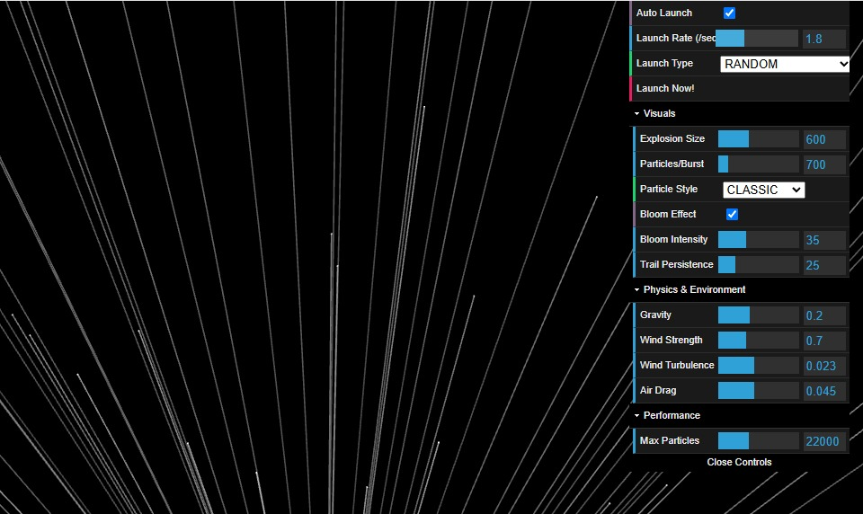

# Quantum-Inspired Fireworks Simulation 🎆

[](LICENSE) 
[]() [](https://github.com/Owono2001/)

> An advanced particle system simulation creating stunning, dynamic fireworks displays in real-time 3D. This project explores the intersection of physics simulation, fluid dynamics principles, and genetic algorithms to generate unique and evolving pyrotechnic effects.

<br>

<p align="center">
    
   <br>
</p>

---

## ✨ Core Features

* **🌌 Real-time 3D Rendering:** Watch vibrant fireworks explode and fade in a 3D space (e.g., using WebGL/Canvas).
* **🎮 Interactive GUI Controls:** Fine-tune simulation parameters like gravity, particle lifespan, explosion characteristics, color palettes, and more via an intuitive graphical interface.
* **💨 Physics-Based Simulation:** Particles are influenced by simulated gravity, air resistance, and potentially other forces for realistic motion.
* **🌊 Fluid Dynamics Inspiration:** Smoke trails and explosion patterns draw inspiration from fluid dynamics principles for more organic visuals.
* **🧬 Genetic Algorithm Driven Evolution:** Discover unique firework types as the simulation uses genetic algorithms to evolve and combine characteristics over time.
* **🎨 Multiple Firework Types:** Features various classic firework styles (like Peony, Chrysanthemum) alongside algorithmically generated novel types.
* **🖱️ Interactive Camera:** (Optional - add if you have it) Control the viewpoint to observe the fireworks from different angles.

---

## 🔬 Core Concepts Explained

* **Particle System:** The foundation of the simulation. Each firework burst releases thousands of particles, each with properties like position, velocity, color, and lifespan, updated each frame.
* **Fluid Dynamics (Simplified):** While not a full fluid simulation, visual elements like smoke dissipation and burst shapes mimic fluid behavior using techniques like noise fields or specific particle movement rules.
* **Genetic Algorithms:** Used to create variety. Firework properties (color, burst pattern, timing) are encoded like 'genes'. New fireworks can be 'bred' by combining and slightly mutating the properties of successful previous ones, leading to an evolving display.

---

## 🚀 Technologies Used

* **Core:** HTML5, CSS3, JavaScript (ES6+)
* **Rendering:** [Specify: e.g., Plain Canvas API, p5.js, Three.js, etc.]
* **GUI:** [Specify: e.g., dat.GUI, lil-gui, Tweakpane, custom]
* **(Other Libraries):** [e.g., Noise functions library, Vector math library, etc.]

---

## 🔧 Running Locally

This project runs directly in the browser. No complex build steps required!

1.  **Clone the Repository:**
    ```bash
    # Replace YOUR-USERNAME/YOUR-REPO-NAME with the actual path
    git clone [https://github.com/Owono2001/YOUR-REPO-NAME.git](https://www.google.com/search?q=https://github.com/Owono2001/YOUR-REPO-NAME.git) 
    ```
    *(Make sure to update the URL above to your actual repository!)*

2.  **Navigate to Project Directory:**
    ```bash
    cd YOUR-REPO-NAME 
    ```
    *(Use the actual directory name)*

3.  **Open the HTML File:**
    Simply open the `index.html` (or the main HTML file) in your preferred modern web browser (like Chrome, Firefox, Edge).

---

## 🎮 Controls & Interaction

* **GUI Panel:** Use the control panel (usually located in a corner of the screen) to adjust various simulation parameters in real-time. Experiment to see how they affect the fireworks!
* **(Add other controls):** [e.g., Click/Drag to create fireworks? Mouse wheel to zoom? Keyboard shortcuts?]

---

---

## 📜 License

Distributed under the MIT License. See the `LICENSE` file for more information.

*(Ensure you have a LICENSE file in your repository)*

---

<p align="center">
  Enjoy the generative spectacle! ✨
</p>
